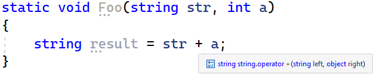
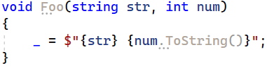

# [C#에서는 문자열 연결(string concatenation)과 보간(string interpolation) 시에 항상 박싱(boxing)이 발생하나요?](https://pvs-studio.com/en/blog/posts/csharp/1060/)

C# 개발자들은 "박싱(Boxing)"이라는 용어에 익숙합니다. 이 현상은 명확하게 드러날 수도 있고, 눈치채지 못할 수도 있습니다. 예를 들어, 값 형식(value type)과 문자열(string)을 더할 경우 박싱이 발생할 수도 있고, 발생하지 않을 수도 있습니다. 일종의 "슈뢰딩거의 박싱(Schrödinger's boxing)" 같은 것이죠. 여기서는 이러한 불확실성을 다뤄보려고 합니다.

## How we faced it

이 주제가 갑자기 생겨난 것은 아닙니다. 저는 PVS-Studio 정적 코드 분석기의 C# 개발자입니다. 2023년, 개발 방향 중 하나로 Unity Engine 프로젝트를 위한 진단 규칙을 선택했습니다. 특히, 최적화 가능성을 알려주는 진단 기능을 구현하기로 결정했죠.

우리는 진단 규칙 [V4001](https://pvs-studio.com/en/docs/warnings/v4001/)부터 시작했습니다. 이 규칙은 자주 실행되는 코드에서 박싱이 발생하는 부분을 식별합니다. 박싱은 참조나 값으로 전달하는 것에 비해 계산 비용이 큰 작업입니다. 그래서 박싱이 사용된 사례를 탐지하는 기능을 구현하기로 한 것입니다.

우리가 고려한 사례 중 하나는 문자열과 값의 연결 시 발생하는 박싱이었습니다.

```CSharp
string Foo(int a)
{
  return "The value is " + a;
}
```

겉보기에는 박싱이 항상 발생하는 것처럼 보입니다. 하지만 더 깊이 파고들수록, 상황이 그렇게 단순하지 않다는 것을 알게 되었습니다.

## Where does boxing with concatenation even come from?

박싱은 값 형식(variable of a value type)을 Object 형식이나 해당 값 형식이 구현한 인터페이스 형식으로 변환할 때 발생합니다. 이 변환은 명시적(explicit)일 수도 있고 암시적(implicit)일 수도 있습니다. 명시적 변환은 직접적인 형 변환(cast)으로 간주됩니다.

```CSharp
var boxedInt = (object)1;
```

암시적 변환은 값 형식의 변수가 참조 형식(`Object` 타입의 참조이거나, 해당 값 형식이 구현한 인터페이스에 대한 참조)이 필요한 곳에서 사용될 때 발생합니다.

```CSharp
bool Foo(object obj, int number)
{
  return obj.Equals(number);
}
```

예를 들어, `Equals` 메서드는 `Object` 타입의 인수를 기대하므로, 값 형식인 `number`를 전달할 경우 박싱이 발생하게 됩니다.

그렇다면 문자열 연결(concatenation)에서는 어떤 일이 일어날까요? 이 질문에 대해서는 Visual Studio가 답을 줄 수 있습니다.



연결 연산자는 오른쪽 피연산자로 Object 타입을 받습니다. 즉, a 값이 박싱된다는 의미입니다. 적어도 겉보기에는 그렇게 보입니다.

## The truth is in IL code

물론, IDE의 힌트를 곧이곧대로 받아들일 수는 없습니다. 위의 코드가 실제로 어떤 동작을 하는지 살펴봅시다.

```CSharp
.method private hidebysig static void  Foo(string str,
                                           int32 a) cil managed
{
  ....
  IL_0001:  ldarg.0
  IL_0002:  ldarg.1
  IL_0003:  box      [mscorlib]System.Int32
  IL_0008:  call     string [mscorlib]System.String::Concat(object,
                                                            object)
  IL_000d:  stloc.0
  IL_000e:  ret
}
```

리뷰를 쉽게 하기 위해 생성된 IL 코드를 조금 축약했습니다. 여기서 핵심은 box 명령어를 확인하는 것입니다. 이 명령어가 a 변수에 대해 박싱이 발생했음을 보여줍니다. 또한 호출되는 String.Concat 메서드가 String과 Object가 아닌, 두 개의 Object 타입 참조를 받는다는 점도 확인할 수 있습니다. 어쨌든, 박싱이 발생했다는 사실은 부정할 수 없습니다.

여기까지는 모두 논리적으로 보이지만, 그럼에도 불구하고 이런 형태의 문자열 연결에서 박싱이 항상 발생하는 것은 아닙니다.

“아니, 그럴 수가 있나?” 우리는 분명히 IL 코드에서 box 명령어를 봤잖아! 그게 박싱 아닌가? 그럼 컴파일 결과를 다시 한번 확인해봅시다.

```CSharp
.method private hidebysig static void  Foo(string str,
                                           int32 a) cil managed
{
  ....
  IL_0001:  ldarg.0
  IL_0002:  ldarga.s   a
  IL_0004:  call       instance string [mscorlib]System.Int32::ToString()
  IL_0009:  call       string [mscorlib]System.String::Concat(string,
                                                              string)
  IL_000e:  stloc.0
  IL_000f:  ret
}
```

앞서 언급한 것처럼, 이번에는 박싱이 발생하지 않았습니다 :)

자, 눈치 빠른(혹은 그렇지 않은) 독자들은 아마 이미 눈치챘을 겁니다. 두 경우의 IL 코드가 눈에 띄게 다르다는 것을요. 실제로 이전 예제에서는 box 명령어와 String.Concat(object, object) 호출이 있었지만, 이번에는 숫자 변수에 대해 ToString 메서드가 호출되고 있습니다. 이후 두 개의 문자열을 연결하는 방식으로 처리되죠. 이 흐름은 꽤 논리적입니다.

하지만 중요한 점은, 두 예제의 소스 코드가 완전히 동일하다는 것입니다.

## What's the difference?

이 차이는 빌드 알고리즘에 있다는 것을 쉽게 짐작할 수 있습니다. 실제로 어떤 버전부터 C# 컴파일러가 이런 문자열 연결을 자동으로 최적화하기 시작했습니다. 제가 확인한 바로는, Visual Studio 2019 이상에서 코드를 컴파일하면 박싱이 발생하지 않습니다. 그래서 저는 이 상황을 더 깊이 파보기로 했고, 여러 플랫폼에서의 동작을 대략적으로 살펴보았습니다.

먼저 .NET Framework 프로젝트의 상황은 단순합니다. Visual Studio 2017 이하에서 MSBuild를 사용해 프로젝트를 빌드하면, 문자열 연결 시 박싱이 최적화되지 않습니다. 이때 타겟 플랫폼의 버전은 영향을 주지 않습니다 (최신 버전을 선택해도 최적화는 발생하지 않았습니다).

.NET Core 3.1부터는 이 최적화를 지원합니다. 여기서도 중요한 점은 TargetFramework의 버전이 아니라 SDK 버전에 따라 결정된다는 것입니다.

.NET 5 이상에서 이러한 최적화가 존재한다는 것은 더 이상 놀라운 일도 아니겠죠.

## Runtime optimization

호기심 많은 일부 독자들은 JIT(Just-In-Time) 컴파일러가 문자열 연결 시 박싱을 제거할 수 있지 않을까 의심할 수도 있습니다. 실제로 그런 최적화는 이론적으로 가능해 보이죠.

그래서 저는 .NET Framework용 프로젝트에서 이를 테스트해보았습니다. 안타깝지만, 최적화는 일어나지 않았습니다. IL 코드에 박싱이 존재한다면, 런타임에서도 실제로 그 박싱이 수행됩니다 (할당 횟수 차이로 확연히 드러납니다).

이 주제에 관심이 있고 더 깊이 파보고 싶다면, 여러분이 발견한 점들을 댓글로 공유해 주세요 :).
그리고 지금은, 이와 관련된 또 다른 흥미로운 질문을 함께 살펴보는 것이 어떨까요?

## Interpolation

자, 우리는 문자열 연결에서의 박싱이 무엇인지 알아냈습니다. 그렇다면 비슷한 연산인 문자열 보간(interpolation)은 어떨까요? 결국 이것도 여러 요소를 하나의 문자열로 결합하는 것이니까요. 하지만 실제로는 전혀 그렇지 않습니다. 우선, 선택한 타겟 플랫폼에 따라 차이가 있다는 점을 주목할 필요가 있습니다.

### .NET Framework

다음 예제를 살펴봅시다:

```CSharp
void Foo(string str, int num)
{
  _ = $"{str} {num}";
}
```

속임수 없이, 이 코드는 Visual Studio 2022에서 컴파일되었으며, 어떤 부자연스러운 행동도 하지 않았다는 점을 미리 말해둡니다 :). 결과를 확인해봅시다:

```CSharp
.method private hidebysig instance void  Foo(string str,
                                             int32 num) cil managed
{
  ....
  IL_0001:  ldstr      "{0} {1}"
  IL_0006:  ldarg.1
  IL_0007:  ldarg.2
  IL_0008:  box        [mscorlib]System.Int32
  IL_000d:  call       string [mscorlib]System.String::Format(string,
                                                              object,
                                                              object)
  IL_0012:  pop
  IL_0013:  ret
}
```

음, 결과는 실망스럽습니다. 보간의 경우, 최신 컴파일러 버전에서도 박싱이 사라지지 않습니다.

이제 ToString을 호출해 봅시다:



Visual Studio에 설치된 IDE0071 규칙은 "불필요한" ToString 호출을 삭제하라고 제안합니다. 하지만 이런 호출의 이점은 명확합니다:

```CSharp
.method private hidebysig instance void  Foo(string str,
                                             int32 num) cil managed
{
  ....
  IL_0001:  ldarg.1
  IL_0002:  ldstr      " "
  IL_0007:  ldarga.s   num
  IL_0009:  call       instance string [mscorlib]System.Int32::ToString()
  IL_000e:  call       string [mscorlib]System.String::Concat(string,
                                                              string,
                                                              string)
  IL_0013:  pop
  IL_0014:  ret
}
```

박싱이 발생하지 않습니다. 게다가 `String.Format` 호출조차 없습니다. 컴파일된 코드는 단순히 3개의 문자열을 이어붙이는 형태로 최적화되었습니다.

### .NET Core and .NET

같은 예제를 가지고 여러 플랫폼에서의 동작을 살펴봅시다:

```CSharp
void Foo(string str, int num)
{
  _ = $"{str} {num}";
}
```

실험 결과, 최적화 여부는 오직 프로젝트의 타겟 플랫폼에만 의존한다는 것이 드러났습니다. 프로젝트가 .NET Core나 .NET 5를 대상으로 설정되어 있다면, 생성된 IL 코드는 .NET Framework와 동일합니다. 다시 말해, 어떠한 최적화도 일어나지 않고, 박싱이 수행된 후 String.Format이 호출됩니다.

하지만 프로젝트가 .NET 6 이상을 대상으로 할 경우, 컴파일 결과는 눈에 띄게 달라집니다:

```CSharp
.method private hidebysig instance void  Foo(string str,
                                             int32 num) cil managed
{
  ....
  .locals init (valuetype DefaultInterpolatedStringHandler V_0)
  IL_0000:  nop
  IL_0001:  ldloca.s V_0
  IL_0003:  ldc.i4.1
  IL_0004:  ldc.i4.2
  IL_0005:  .... DefaultInterpolatedStringHandler::.ctor(int32, int32)
  IL_000a:  ldloca.s   V_0
  IL_000c:  ldarg.1
  IL_000d:  .... DefaultInterpolatedStringHandler::AppendFormatted(string)
  IL_0012:  nop
  IL_0013:  ldloca.s V_0
  IL_0015:  ldstr " "
  IL_001a:  .... DefaultInterpolatedStringHandler::AppendLiteral(string)
  IL_001f:  nop
  IL_0020:  ldloca.s   V_0
  IL_0022:  ldarg.2
  IL_0023:  .... DefaultInterpolatedStringHandler::AppendFormatted<int32>(!!0)
  IL_0028:  nop
  IL_0029:  ldloca.s   V_0
  IL_002b:  .... DefaultInterpolatedStringHandler::ToStringAndClear()
  IL_0030:  pop
  IL_0031:  ret
}
```

코드를 읽기 쉽게 하려고 상당 부분 축약했습니다. 말 그대로, 이제 단순한 String.Format 호출과는 거리가 생겼죠 :) 대신에, 문자열을 구성하는 데 [DefaultInterpolatedStringHandler](https://learn.microsoft.com/en-us/dotnet/api/system.runtime.compilerservices.defaultinterpolatedstringhandler?view=net-6.0) 구조체가 사용됩니다. 이 접근 방식의 성능에 대한 분석은 이 글의 범위를 벗어나지만, (IL 코드의 양에 질리지 않았다면) 한 가지는 확실히 눈에 띕니다.

바로 이 호출입니다:
DefaultInterpolatedStringHandler::AppendFormatted<int32>(!!0)
솔직히 말해서 이 !!0이 정확히 뭔지는 모르겠지만, 제네릭 매개변수에 int32가 지정되어 있다는 것만 봐도 값 형식의 박싱은 발생하지 않음을 알 수 있습니다.

결론: .NET 6, 최고입니다! :)

## Conclusion

일반적으로, 예전 버전의 컴파일러를 사용할 경우 문자열 연결 시 박싱이 실제로 발생합니다. 따라서 ToString 호출을 사용하는 것이 좋은 방법입니다. 물론, 최신 버전의 컴파일러에서는 어차피 박싱이 발생하지 않으므로 걱정할 필요는 없습니다. (이제 면접에서 이런 걸로 지원자 괴롭히는 사람은 없겠죠? ^^)

하지만 프로젝트의 타겟이 .NET 6 이상일 때만, 문자열 보간(interpolation)은 박싱으로부터 안전합니다. 그 외의 경우에는 보간 요소에 대해 ToString을 명시적으로 호출하는 것이 꽤 유용할 수 있습니다.